Preparing BitTags for flight requires the following steps:

1.  Charging -- be prepared to charge each tag for at least 2 days
2.  Configuring -- the data collection protocol including start/end times, hibernation periods, and sensor parameters.
3.  Insulating -- after configuration the test points should be immediately covered with insulating tape
4.  Harness attachment

In this guide we discuss 1-3.  **Note** some of the photos were made with earlier versions of the tags and tag bases; however, the principles remain the same.

## Visual Glossary

### Bit Tags



Ultra-low power reusable accelerometer loggers, capable of logging  activity up to a year

<---> 
 

<---> 



### Charger Bases


Charges Bit Tag batteries and displays battery charge status.

<--->



### Programmer Base



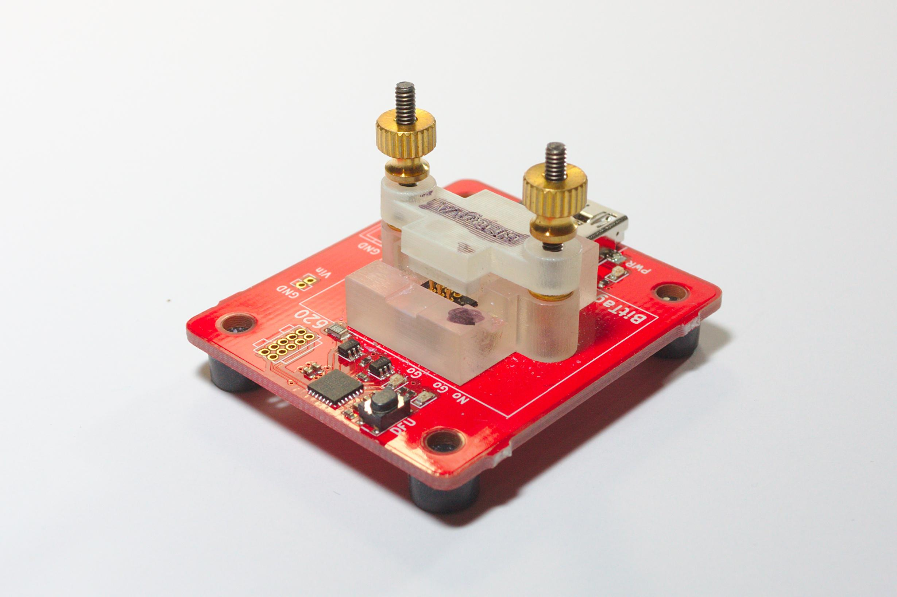


Allows data transfer between Bit Tags and computer, for configuration
and data downloading


###  Mini-USB Cable


Delivers power and data to Bit Tag chargers and programming base.

<--->

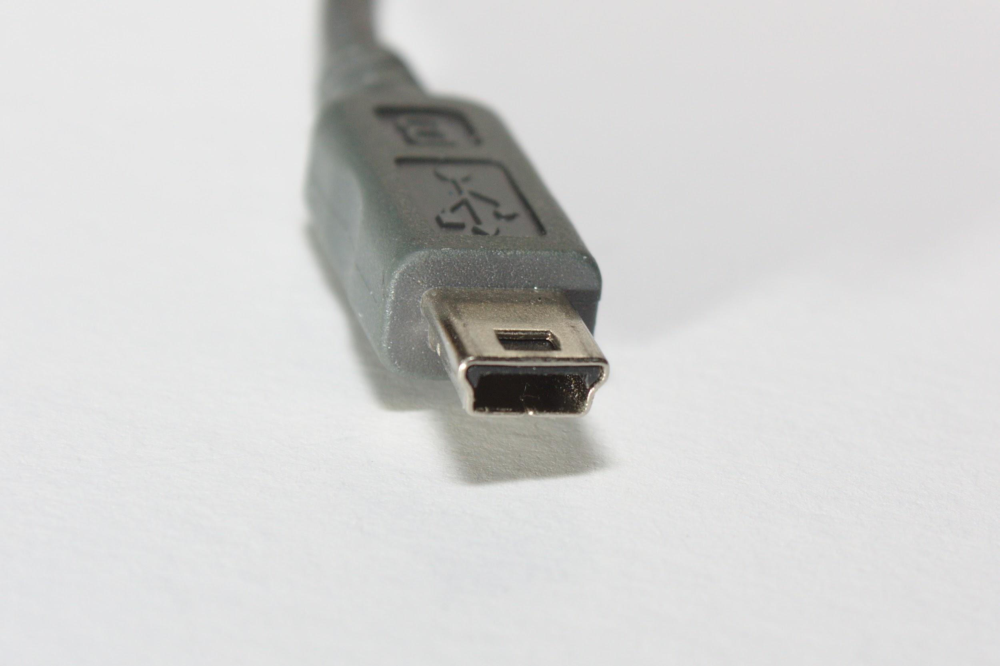


### Insulating Tape (3mm Kapton)


Protects Bit Tag contacts from short-circuits.
<--->



###  Tape Application Sticks (4mm width)


Flat wooden sticks, commonly used as coffee stirrers. Useful for
applying tape to Bit Tags, and for measuring tape length.

<--->

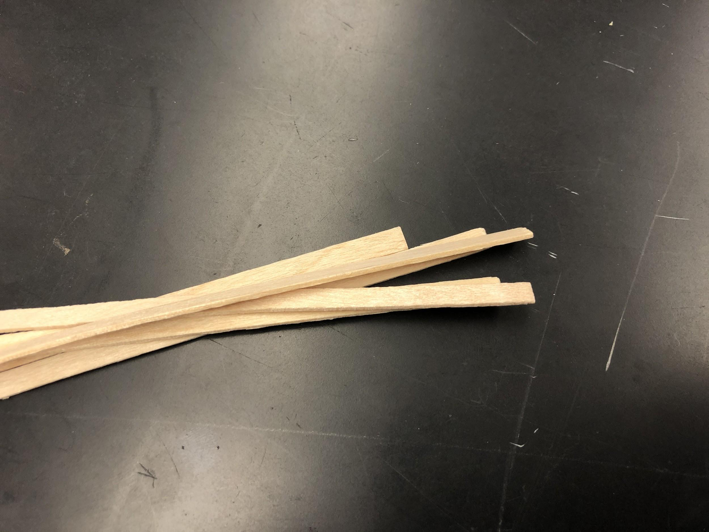



###  Harness Material


Elastic sewing thread.  May also be available through dental supply houses.
<--->



###  Scissors


For cutting tape and harness material. The smaller the better.

<--->



### Monitor Program


Configures and downloads data from BitTag

<--->



###  btviz Program


Displays data and generates actograms.

<--->


 

## BitTags
--------



<--->



### Specifications

-   Weight (Without Harness) **0.64g**

-   Dimensions **22Lx9Wx6H mm**

-   Run Time (Depends on mode, limited by battery size)

    -   Bits Per Second **239 hours (\~10 days)**

    -   Counts per Minute **2395 hours (\~100 days)**

    -   Counts per 4 Minutes **9900 hours (\~414 days)**

    -   Counts per 5 Minutes **8700 hours (\~362 days)**

-   Battery Capacity **5.5 mAh**

-   Average Current Consumption **\< 1uA**

-   CPU **STM32L432KC**

-   Accelerometer **ADXL362**

-   Clock Accuracy **±3ppm**

## Pre-Flight

### 1. Charge Bit Tags



Plug in Charger Base and ensure it is receiving power. A green light will illuminate on the Charger Base that is plugged in.  All other Charger Bases can then share power from this Charger Base.

<--->





Remove nuts and lid from Charger Base

<--->





Place Bit Tag in the plastic holder, ensuring it seats fully.

<--->
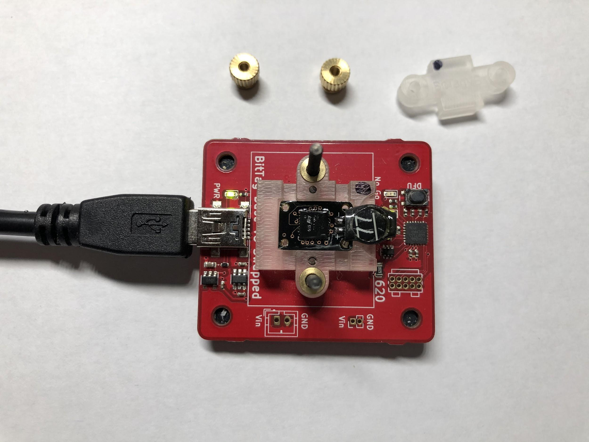





Place lid on base, aligning dots.

<--->




Gently tighten nuts with one finger, to avoid damaging delicate electronics.

<--->

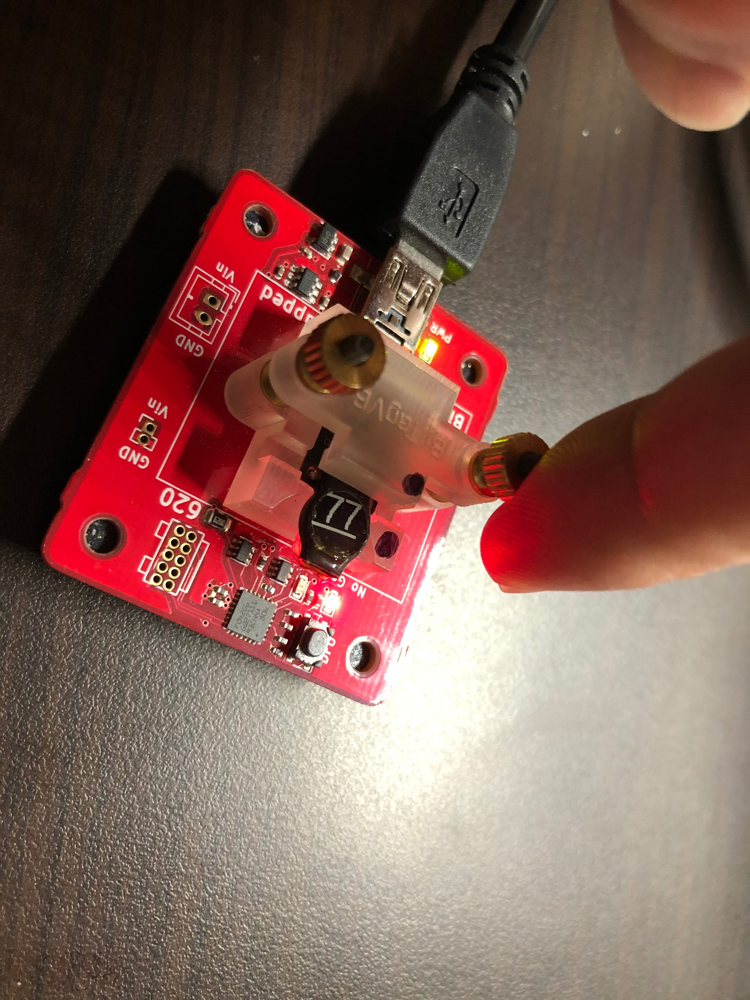




* Check to make sure BitTag makes contact with charger.
* Bit Tags typically take 48-27 hours to charge.
* Charging is **Not** complete when the battery indicator turns from red to green.  To fully charge, batteries must be held at their charge voltage for 24-48 hours.
<--->
 
 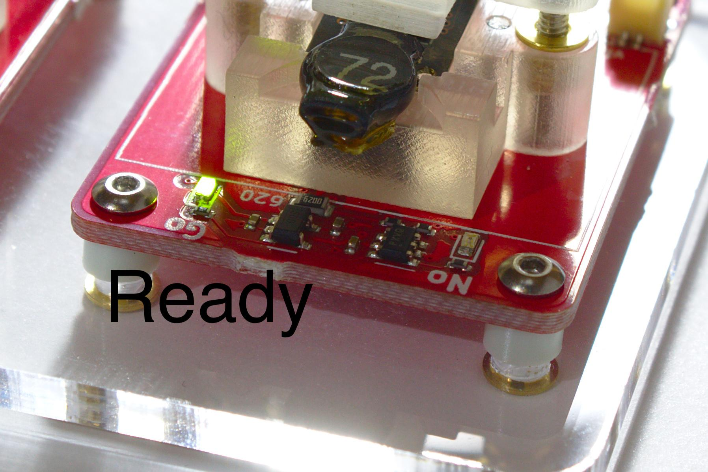
 

* Remove Bit Tags when done charging. Unused Bit Tags can store  for 1-2 months before needing to be recharged.

* To remove, reverse the installation process.

### 2. Configure Bit Tags

**Note: Images in this section need updating for newer software**


Place Bit Tag in Programmer Base, following the same procedure as installing Bit Tags into chargers.
**Note:** Programmer Base must be plugged into computer before receiving a Bit Tag.
<--->




* Open the monitor program.
* Click "Attach"
* Check that battery voltage is **3.0 volts** or greater. If not, detach and recharge. While still functional, battery voltage below 3.0 volts will result in suboptimal runtimes.

<--->
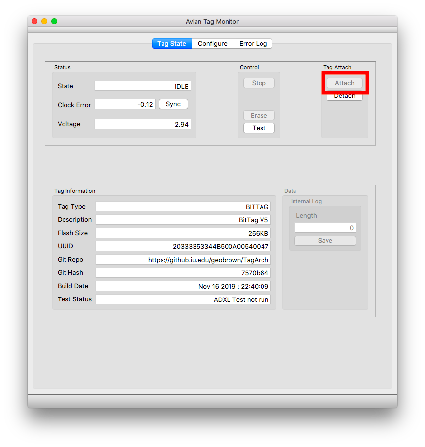

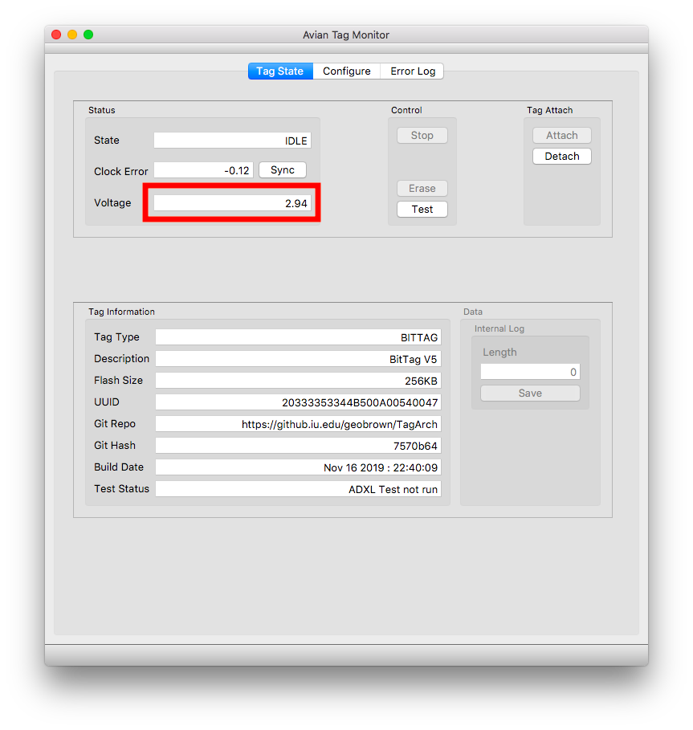




* If Bit Tag is in a state other than "IDLE", you may need to "Stop" and then "Erase" Bit Tag.

<--->
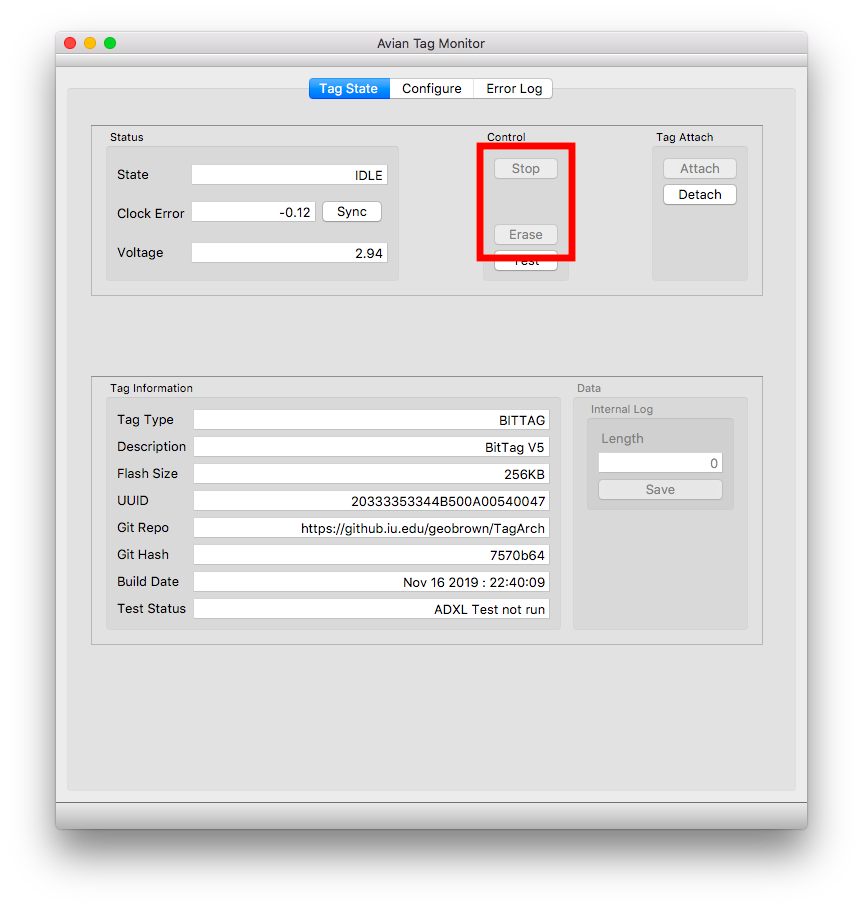



* Once the tag is in the "idle" state, run the internal tests ("Test") and then synchronize the clock "Sync".
* If any tests fail, you should not use the tag.
<--->
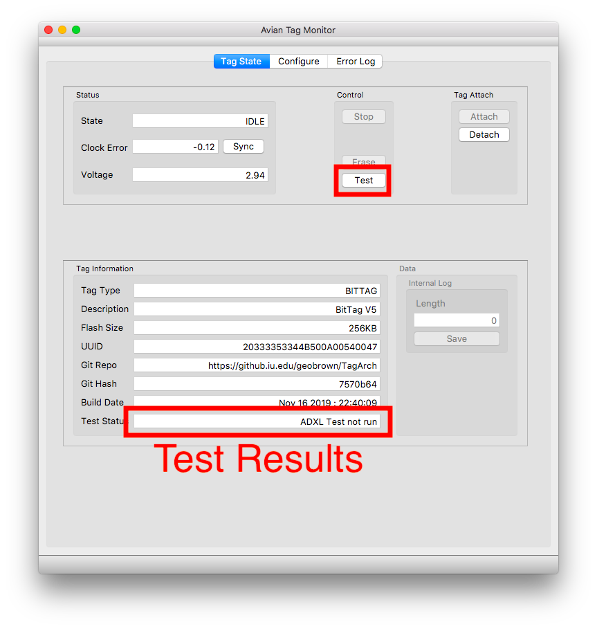





* Click into the "Configure" tab.
* Schedule BitTag Data Collection

<--->



* Select Data Type Log Format based upon experiment requirements
    1.  **Activity Bit Per Second**: Gives second-by-second log of whether or not the animal is active. Highest resolution data. Run Time of around **10 days**.
    2.  **Activity Bit Count Per Minute**: Records the percentage of each minute the animal was active. Run Time of around **100 days**.
    3.  **Activity Bit Count Per Four/Five Minutes**: Same as Activity Bit Count Per Minute, but over four or five minute intervals. Lowest resolution, but allows Run
    Time of around **365 days**.
<--->
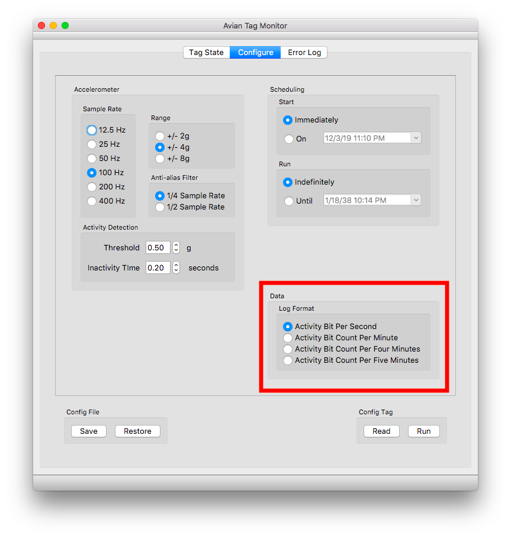



Click "Run" to save settings and start Bit Tag.
<--->
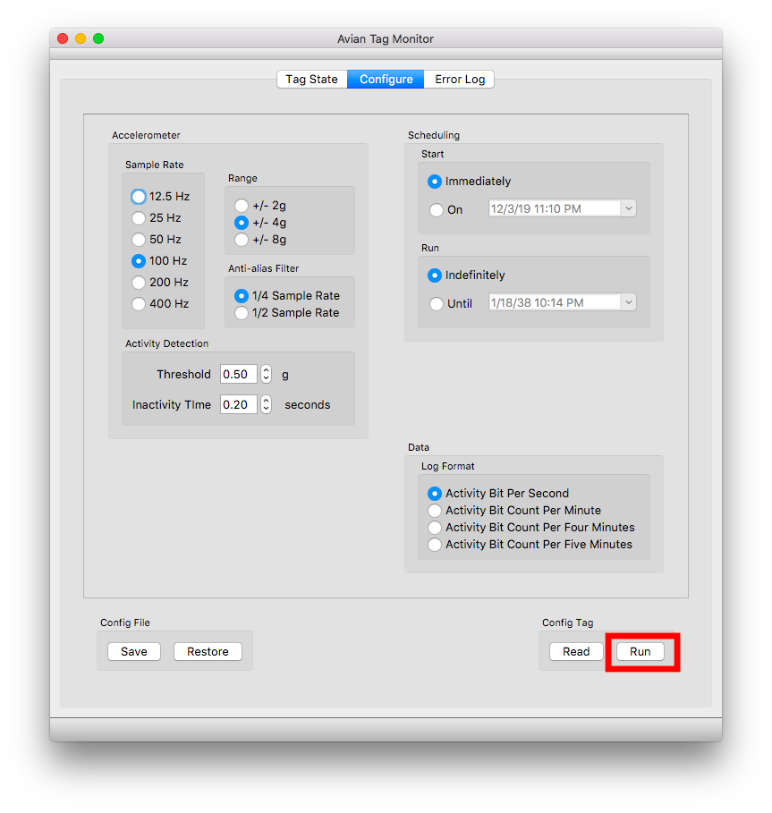



Return to the "Tag State" tab.
Ensure that the Bit Tag is in the "CONFIGURED" or "RUNNING" state. If not, check your configuration and click "Run" again.
<--->




Click "Detach" and  remove BitTag from base.

<--->



### 3. Insulate Bit Tags


Cut a short strip of Insulating Tape just long enough to fully cover contacts (about 4mm - or the width of tape application sticks) on the back of Bit Tag. 
<--->

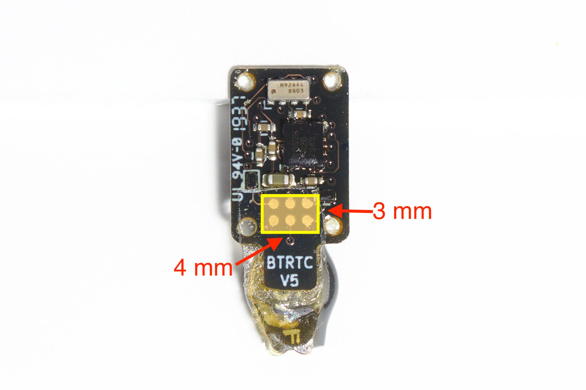




Place tape partially on Tape Application Stick (leaving \~2mm overhang lengthwise) 
and gently stick one edge onto Bit Tag

<--->
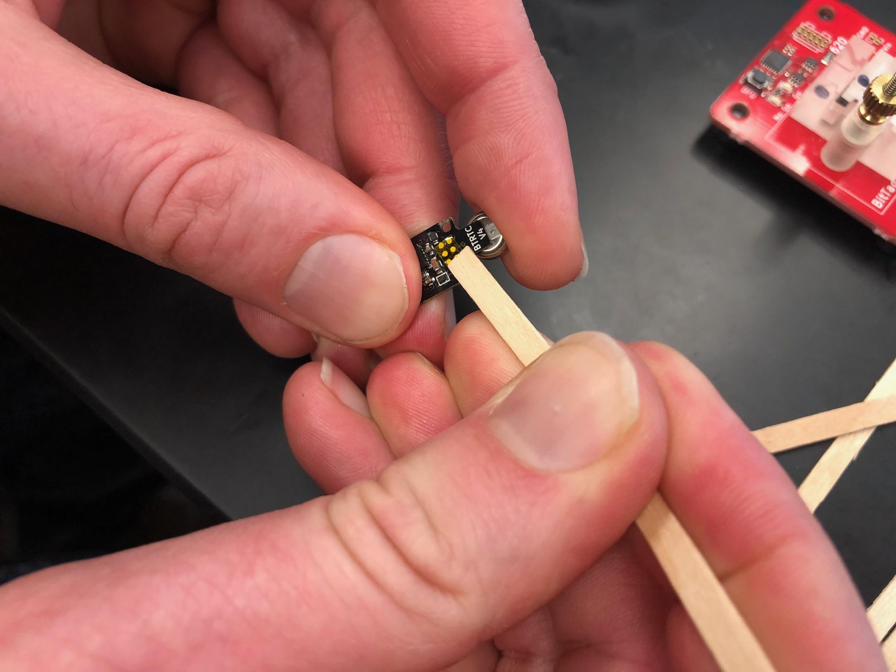




Press stick firmly onto tape and "squeegee" out any air bubbles or pockets. Tape should sit flat on surface of Bit Tag.
<--->



### 4 Build Harnesses

See section ???


Bit Tags can be attached via harness using the four mounting holes (1mm diameter).
For songbird, the size of the leg-loop harness can be estimated using the function described by Naef-Daenzer (2007, J. Avian Biology, 38: 404-407)

<--->
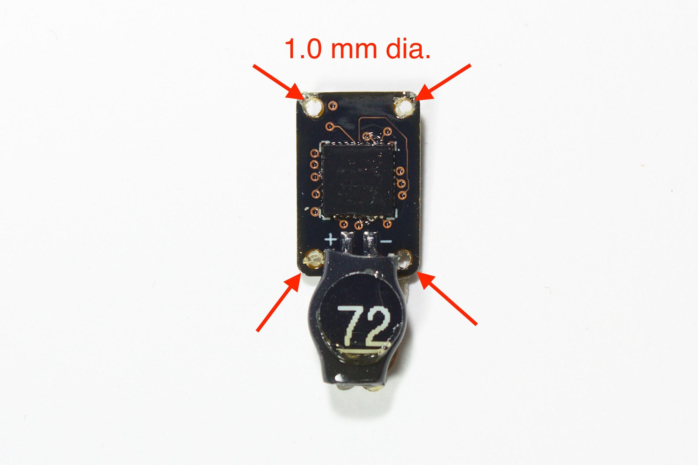



## Post-Processing

### 1 Recovery


Remove harnesses and insulating tape, being careful not to contact the Bit Tag with sharp or metallic tools.
The Tape Application Stick can also be used to gently peel up the tape.

<--->




* Place Bit Tag into Programmer Base.
  -   Note: Ensure Programmer Base is plugged into the computer first.
* Open the monitor program and attach.
<--->




Stop the BitTag.
<--->

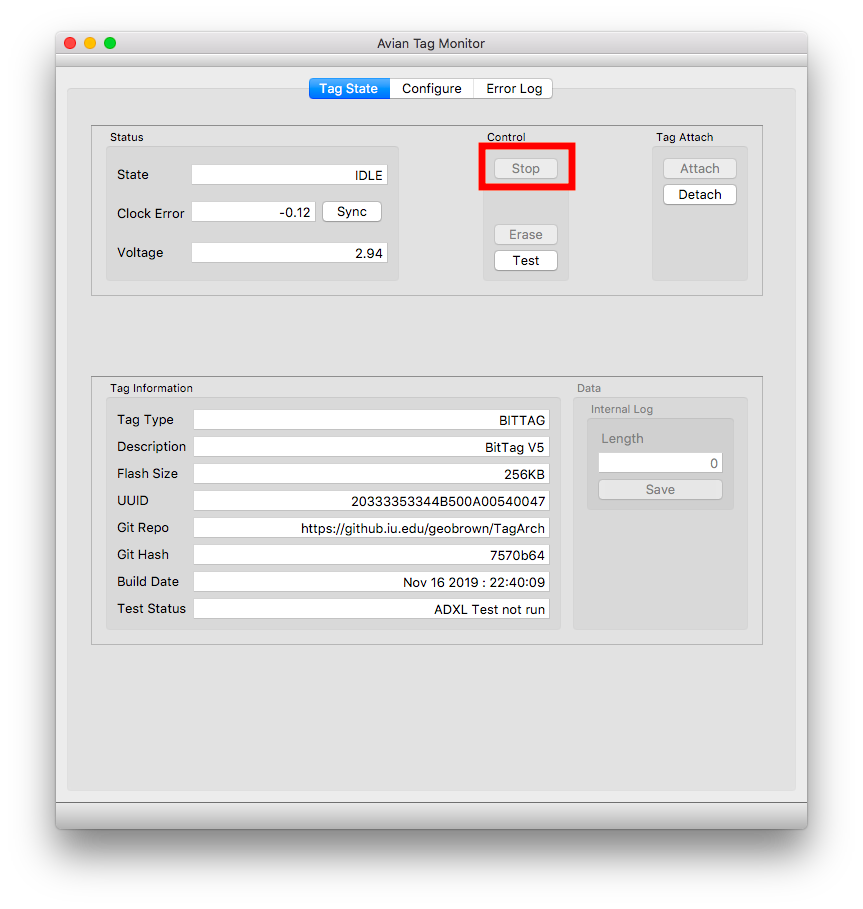



* Save data. **Important:** Save your data as a ".txt" file.
    - **Note: The data length may sometimes show up as zero, even if there is saved data onboard.**
* Detach the BitTag and remove from base.
<--->



### 2 Data Visualization

See Section ???


* Open btviz

* To import data click 'load' and select data file (data file should have a .txt extension)
<--->




If you need to trim your data, enter Start and End times then click "Zoom"
<--->
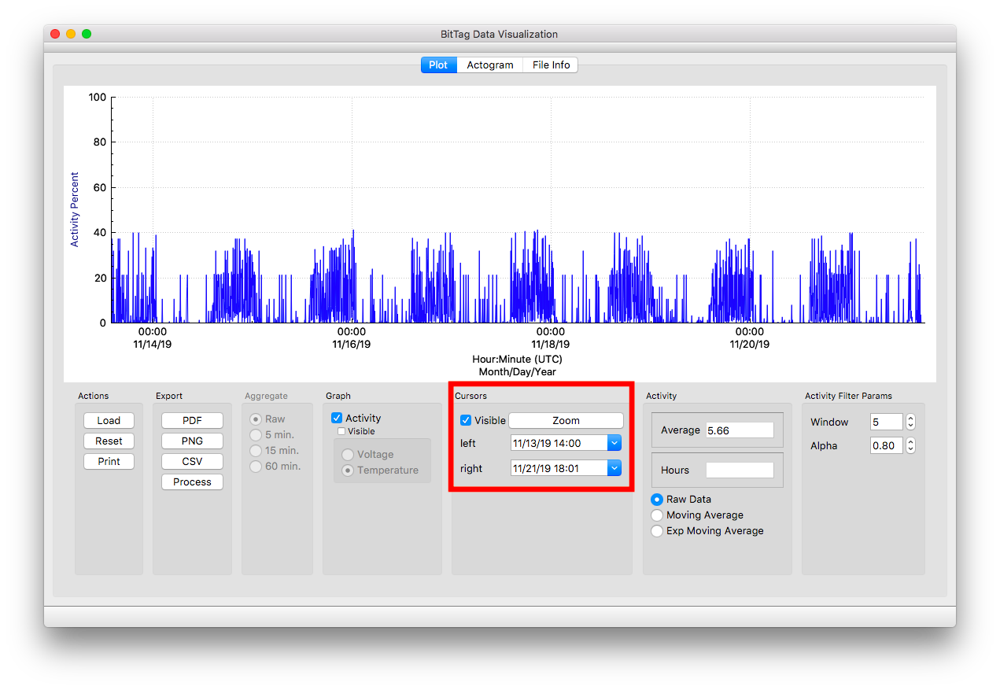



You may also use your mouse to visually select these times:

1.  Double-click on the chart with the Left Mouse Button to set the Start time (One-finger double-click on Mac).

2.  Double-click on the chart with the Right Mouse Button to set the End time (Double-click with two fingers, or while holding Control (⌃) on Mac).
3.  Click "Zoom"

<--->
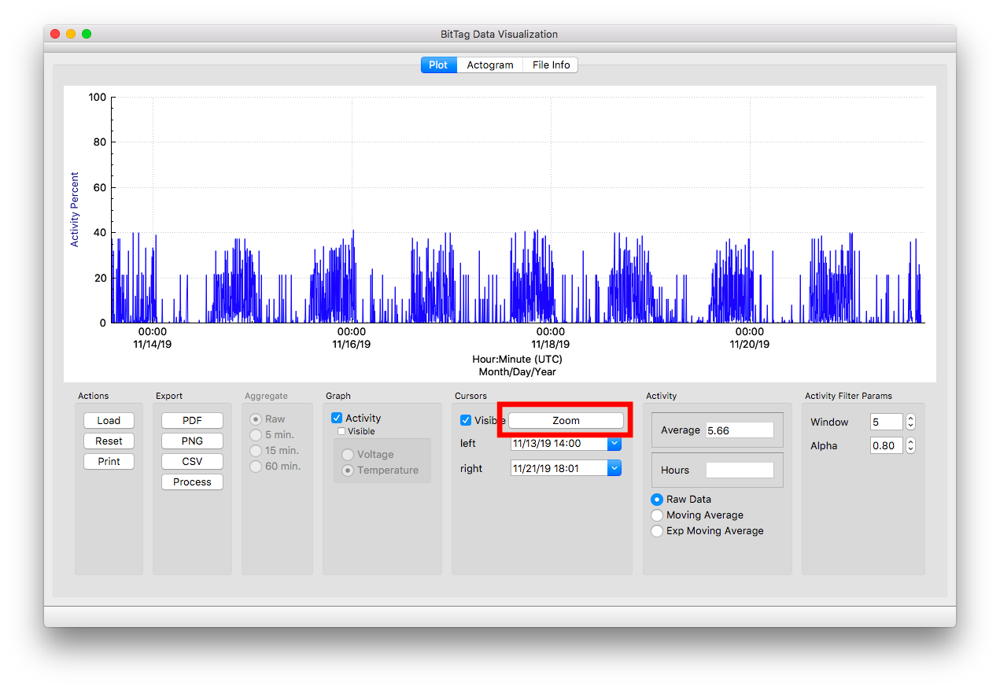



You may export your data in a variety of formats:
* **PDF/PNG**: Saves the currently displayed figure as an image
* **CSV**: Saves all data currently visible in the image as a .csv file of data points.
<--->




You may also view and save actograms by clicking on the 'actogram' tab at the top.
<--->
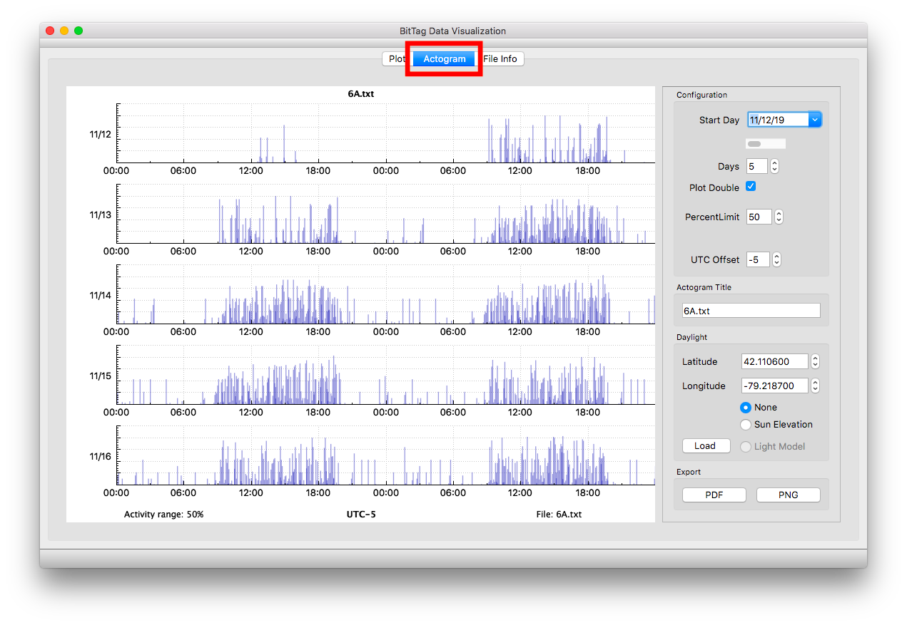


